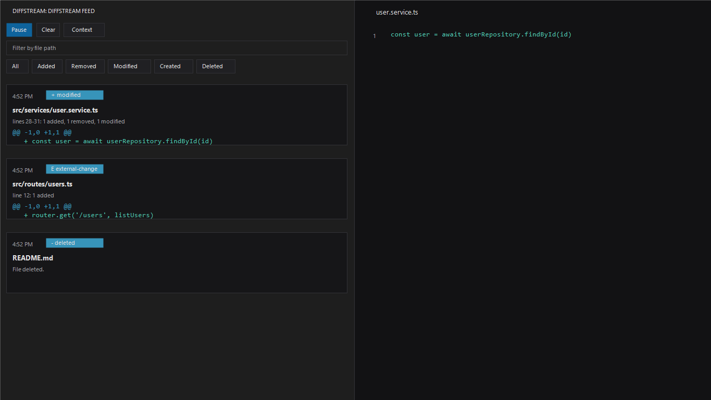

# DiffStream

DiffStream is a Visual Studio Code extension that shows a live feed of file changes in your workspace. It captures edits made in VS Code as well as changes written by terminals, scripts, generators, and other editors, then presents them as compact line-level diffs.



## Why DiffStream

Modern development often happens across several tools at once. A file may change because you saved it, a formatter ran, a CLI updated generated code, or another editor modified the same workspace. Git can show the final result later; DiffStream shows the activity as it happens.

Use DiffStream when you want to:

- Monitor workspace changes without waiting for commits.
- See file creations, deletions, saves, and external updates in one place.
- Review compact line-level diffs while tools are modifying the project.
- Copy a clean change summary for handoff, review, or context sharing.

## Features

- Live workspace monitoring across multiple workspace folders.
- Line-level diffs for added, removed, modified, saved, created, deleted, renamed, and externally changed files.
- Compact event cards with timestamps, relative paths, line ranges, and change counts.
- Sidebar feed with search, type filters, pause/resume, clear, open file, and copy diff actions.
- Best-effort rename detection for rapid delete/create operations with identical content.
- Configurable ignored folders, ignored extensions, debounce delay, feed size, and max file size.
- Binary and large-file safeguards to keep the extension responsive in large repositories.
- Recent feed persistence through VS Code workspace state.
- Theme-aware UI using VS Code color variables.

## Getting Started

Install dependencies and compile the extension:

```bash
npm install
npm run compile
```

Run it in an Extension Development Host:

```bash
code --new-window --extensionDevelopmentPath=.
```

In the development window, open the Command Palette and run:

```text
DiffStream: Open Feed
```

DiffStream starts automatically when a workspace opens, provided `diffstream.enabled` and `diffstream.autoStart` are enabled.

## Commands

| Command | Description |
| --- | --- |
| `DiffStream: Open Feed` | Opens the live change feed. |
| `DiffStream: Start Watching` | Starts workspace monitoring. |
| `DiffStream: Stop Watching` | Stops workspace monitoring. |
| `DiffStream: Pause Feed` | Pauses new feed entries while keeping the watcher available. |
| `DiffStream: Resume Feed` | Resumes feed updates. |
| `DiffStream: Clear Feed` | Removes all current feed entries. |

## Configuration

| Setting | Default | Description |
| --- | --- | --- |
| `diffstream.enabled` | `true` | Enables DiffStream. |
| `diffstream.maxFeedItems` | `300` | Maximum number of feed events kept in memory. |
| `diffstream.debounceMs` | `300` | Per-file debounce delay in milliseconds. |
| `diffstream.maxFileSizeBytes` | `1048576` | Maximum text file size to diff. |
| `diffstream.ignoredGlobs` | Common heavy folders | Glob patterns ignored by the watcher. |
| `diffstream.showInitialFileContentOnCreate` | `true` | Shows initial added lines for created files. |
| `diffstream.showRemovedContentOnDelete` | `false` | Shows removed lines for deleted files. |
| `diffstream.autoStart` | `true` | Starts watching automatically when a workspace opens. |
| `diffstream.ignoredExtensions` | `[]` | File extensions to ignore, such as `.png` or `.lock`. |

## Architecture

```text
VS Code FileSystemWatcher
        |
        v
FileWatcherService -> SnapshotStore -> DiffService
        |                              |
        v                              v
DiffStreamController -----------> FeedStore
        |                              |
        v                              v
StatusBarController             FeedWebviewProvider
```

## Development

Compile:

```bash
npm run compile
```

Run tests:

```bash
npm test
```

Run linting:

```bash
npm run lint
```

Create a local VSIX package:

```bash
npm run package
```

## Publishing

DiffStream uses `@vscode/vsce` for packaging and publishing.

Before publishing, create a Visual Studio Marketplace publisher and authenticate with `vsce`:

```bash
npx vsce login <publisher-id>
```

Then publish:

```bash
npm run publish
```

You can also create a `.vsix` and upload it manually from the Visual Studio Marketplace publisher management page:

```bash
npm run package
```

## Roadmap

- Export feed to a Markdown file.
- Group related rapid changes by file and time window.
- Add optional workspace decorations for recent changes.
- Improve rename detection with similarity scoring.
- Add a compact tree view grouped by file.

## Contributing

Issues and pull requests are welcome. Please keep changes focused, typed, and covered by tests when behavior changes.

## License

MIT
